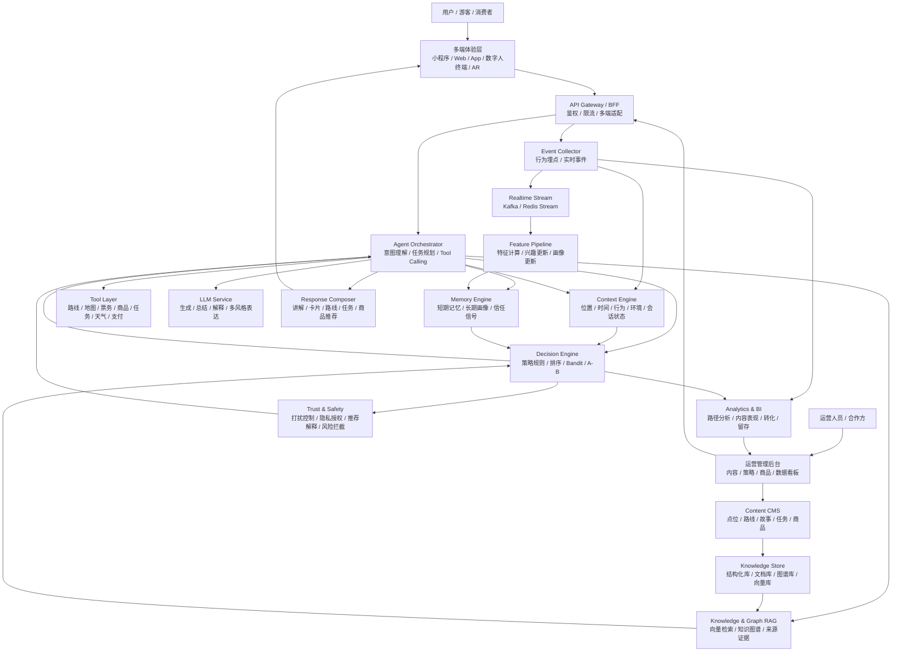
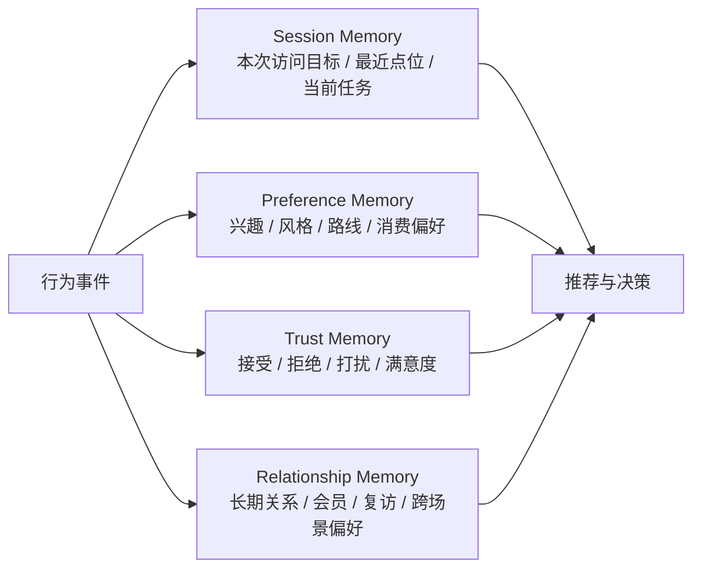
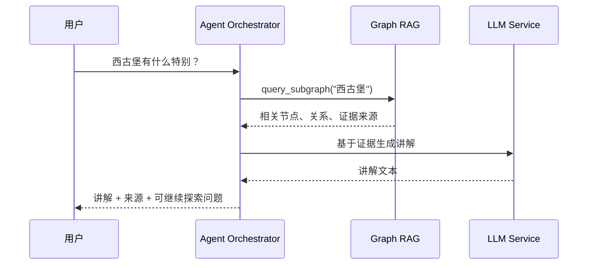
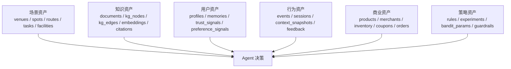
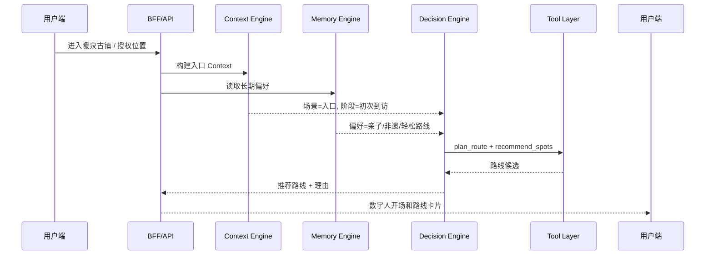
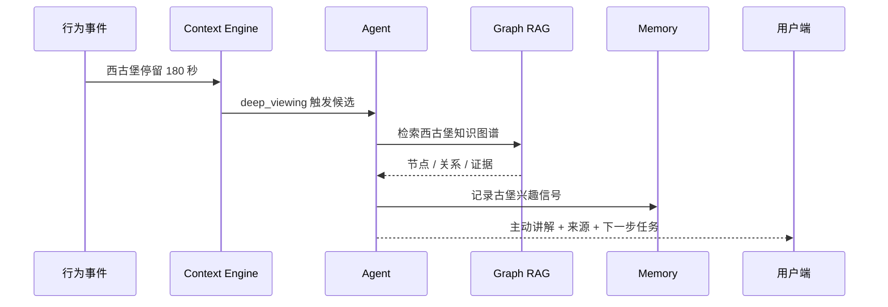
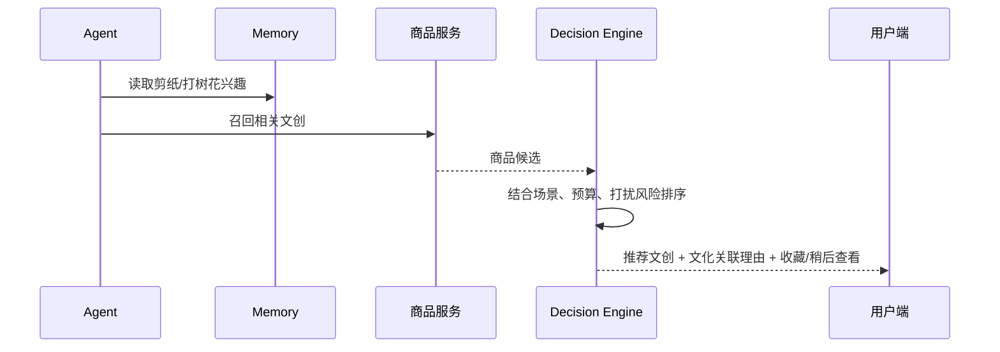
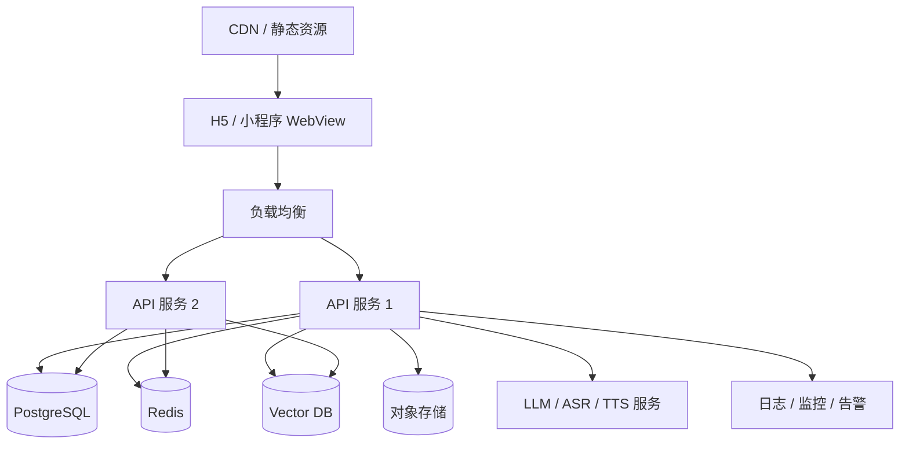

# 产品完全态总架构设计

## 1. 总体定位

本产品的完全态不是单一景区导览系统，而是一个“用户关系驱动的主动式 AI 服务平台”。

暖泉古镇是首个概念验证和场景化 Demo，用来验证以下底层能力：

- Context：理解用户所处场景、位置、时间、行为和意图。
- Memory：沉淀用户长期偏好、关系信号和信任历史。
- Graph RAG：基于可追溯知识提供可信讲解和推荐依据。
- Tool Calling：编排路线、讲解、任务、商品、票务、地图等外部能力。
- Trust：控制打扰频率、解释推荐理由、维护用户信任。
- Service Orchestration：把内容、路线、互动和消费服务组织成连续体验。

长期目标：

> 从“文旅数字人”演进为跨文旅、电商、本地生活、消费服务的用户关系智能体底座。

## 2. 完全态能力边界

### 2.1 面向游客/消费者

- 多模态问答：文字、语音、图片、地图点选、扫码、AR 识别。
- 主动导览：根据位置、时间、停留、兴趣主动推荐下一步。
- 个性化讲解：按用户偏好调整讲解深度、风格和长度。
- 路线规划：按时间、体力、同行人群、拥挤度规划路线。
- 互动任务：亲子、研学、打卡、探索、收集类任务。
- 文创/商品推荐：基于文化兴趣和场景时机推荐低打扰商品。
- 记忆延续：跨场景、跨会话记住用户偏好。

### 2.2 面向景区/场馆/品牌方

- 内容管理：点位、故事、知识来源、任务、路线、商品、活动。
- 运营策略：主动服务触发规则、推荐策略、冷却时间、重点内容曝光。
- 数据分析：用户路径、停留、兴趣、任务完成、推荐点击和转化。
- 内容审核：文化内容、讲解话术、商品推荐、敏感信息审核。
- 商业转化：文创、门票、活动、餐饮、住宿、本地服务推荐。
- 多场景复用：一个底层平台支持多个景区、场馆或消费场景。

## 3. 技术总架构图



## 4. 分层技术架构

### 4.1 体验层

终端形态：

- Web Demo：当前阶段用于概念验证。
- 微信小程序：适合真实景区和本地生活入口。
- App / H5：适合跨景区、多城市、多消费服务。
- 数字人屏幕终端：适合游客中心、展馆入口、商业空间。
- AR / 地图模式：适合实地导览和多模态识别。

核心职责：

- 采集用户输入、位置、点击、停留、反馈。
- 展示对话、路线、任务、讲解、文创商品。
- 展示推荐理由和证据来源。
- 处理用户授权、隐私设置和个性化开关。

### 4.2 API/BFF 层

职责：

- 统一对外 API。
- 多端请求适配。
- 用户鉴权和会话管理。
- API 限流、日志、灰度和版本控制。
- 聚合 Agent、推荐、内容、商品、地图等服务结果。

建议技术：

- Python FastAPI 或 Node.js NestJS。
- OpenAPI 文档。
- JWT / OAuth / 小程序 openid 映射。
- API Gateway：Nginx、Kong、APISIX 或云网关。

### 4.3 Agent Orchestrator

职责：

- 理解用户意图。
- 读取 Context 和 Memory。
- 决定是否调用工具。
- 管理多步 Workflow。
- 生成最终响应结构。

典型流程：

```text
Observe 用户输入和事件
  -> Understand 意图和场景
  -> Recall 读取 Memory
  -> Retrieve 检索知识和证据
  -> Decide 选择服务动作
  -> Act 调用工具
  -> Respond 组合回答和卡片
  -> Reflect 更新记忆和指标
```

建议技术：

- 初期：自研轻量 Orchestrator。
- 中期：可引入 LangGraph / Semantic Kernel / 自研状态机。
- 工具协议：统一 Tool Schema，支持幂等、超时、重试和降级。

### 4.4 Context Engine

Context Engine 是主动服务的实时判断核心。

输入：

- 位置：景区、区域、点位、距离、楼层。
- 时间：当前时段、开放时间、演出时间、剩余游览时间。
- 行为：停留、移动、点击、收藏、跳过、追问、购买。
- 环境：天气、人流、闭馆、活动、网络状态。
- 会话：当前目标、同行人群、路线阶段、任务状态。

输出：

- 当前场景标签：入口、古堡、街巷、表演区、文创店、出口。
- 用户状态：初次到访、深度观看、赶时间、亲子互动、夜游意图。
- 服务候选：讲解、路线、任务、提醒、商品推荐、静默等待。
- 打扰风险：低、中、高。

实现建议：

- MVP：规则 + 会话状态。
- 试点：规则 + 轻量分类模型 + 事件流。
- 完全态：实时特征服务 + 策略引擎 + 个性化阈值。

### 4.5 Memory Engine

Memory 是项目长期价值的核心。

记忆分层：



核心数据：

- 用户显式偏好：喜欢非遗、古建、摄影、亲子任务。
- 用户隐式偏好：停留时间、点击、收藏、跳过、购买。
- 表达偏好：短讲解、故事化、儿童化、专业化。
- 服务偏好：喜欢主动推荐或偏好安静浏览。
- 信任信号：推荐是否被接受、是否被认为有帮助。
- 消费偏好：价格区间、品类偏好、购买时机。

关键原则：

- 区分事实、推断和临时状态。
- 每条 Memory 应有来源、时间、置信度和可删除能力。
- 用户可查看、关闭、清除或修正个性化记忆。
- 不把一次行为直接写成长期偏好。

### 4.6 Knowledge & Graph RAG

知识系统负责“讲得准”和“解释得清”。

数据形态：

- 文档库：官方介绍、地方志、讲解稿、运营资料、FAQ。
- 结构化库：点位、路线、任务、商品、活动、设施。
- 知识图谱：地点、人物、事件、非遗、文保单位、文创、任务之间的关系。
- 向量库：支持语义检索和长文本召回。
- 证据库：来源、链接、审核状态、适用范围。

Graph RAG 流程：



当前暖泉 Demo 已实现：

- 从 `nuanquan_demo_data.json` 动态构建图谱。
- 点位、任务、文创、核心主题转为节点。
- 包含点位、触发任务、关联文创转为边。
- Graph RAG 返回证据来源。

完全态增强：

- 引入向量检索。
- 图谱节点与向量片段联合召回。
- 内容审核状态参与检索。
- 支持多语言和多风格讲解。
- 为每个回答生成“为什么这样说”的来源解释。

### 4.7 Decision Engine

Decision Engine 负责决定下一步服务动作。

输入：

- Context Snapshot。
- User Memory。
- Knowledge/RAG 结果。
- 运营策略。
- 商品/任务/路线候选。
- 安全和打扰规则。

输出：

- `service_intent`：讲解、路线、任务、提醒、商品推荐、静默等待。
- `ranking_result`：候选路线/内容/商品排序。
- `reason`：推荐原因。
- `confidence`：置信度。
- `guardrails`：限制和安全提示。

策略组合：

- 规则策略：适合冷启动和运营可控。
- 召回排序：候选路线、点位、任务、商品。
- Contextual Bandit：在不同策略中探索最优推荐。
- A/B 测试：验证主动服务、文创推荐、讲解风格效果。
- Trust Guard：控制频率、避免过度打扰。

### 4.8 Tool Layer

工具层将 AI 决策变成真实服务。

核心工具：

- `recommend_spots`：点位推荐。
- `plan_route`：路线规划。
- `search_cultural_knowledge`：文化知识检索。
- `generate_explanation`：个性化讲解。
- `trigger_task`：互动任务触发。
- `recommend_products`：文创/商品推荐。
- `check_schedule`：演出、活动、开放时间。
- `map_navigation`：地图导航和距离计算。
- `ticket_booking`：票务或预约。
- `update_user_memory`：记忆更新。
- `log_event`：行为记录。

工具规范：

- 每个工具必须有输入 schema、输出 schema、错误码。
- 支持超时、重试、降级。
- 工具结果应可追踪，便于解释和复盘。
- 涉及交易、票务、隐私的工具必须有显式用户确认。

## 5. 数据总架构

### 5.1 数据域划分



### 5.2 核心表设计建议

场景与内容：

- `venues`：场景/景区/门店。
- `spots`：点位。
- `routes`：路线。
- `route_spots`：路线点位顺序。
- `tasks`：互动任务。
- `facilities`：卫生间、停车、游客中心、休息区。
- `events_schedule`：表演、活动、开放时间。

知识库：

- `documents`：原始资料。
- `knowledge_chunks`：切片文本。
- `kg_nodes`：知识图谱节点。
- `kg_edges`：知识图谱关系。
- `citations`：来源证据。
- `embeddings`：向量索引引用。

用户与记忆：

- `users`：用户主表。
- `sessions`：访问会话。
- `user_profiles`：画像摘要。
- `memory_items`：长期记忆条目。
- `preference_signals`：偏好信号。
- `trust_signals`：信任信号。
- `recommendation_history`：推荐历史。

行为与实验：

- `events`：行为事件。
- `context_snapshots`：上下文快照。
- `ab_assignments`：实验分组。
- `strategy_metrics`：策略指标。
- `tool_calls`：工具调用日志。

商业：

- `products`：商品/文创。
- `merchants`：商户。
- `inventory`：库存。
- `orders`：订单。
- `coupons`：优惠或权益。

### 5.3 存储选型

MVP：

- JSON 文件：场景数据种子。
- 内存：会话和短期记忆。
- FastAPI：API 和 Demo。

试点：

- PostgreSQL：业务数据、用户、内容、行为。
- Redis：Session、实时 Context、冷却状态。
- pgvector / Qdrant / Milvus：向量检索。
- 对象存储：图片、音频、文档。

完全态：

- PostgreSQL + 分区表：核心交易和业务数据。
- Redis Cluster：实时状态和缓存。
- Kafka / Pulsar：事件流。
- Elasticsearch / OpenSearch：检索和日志。
- Neo4j / NebulaGraph / PostgreSQL 图模型：知识图谱。
- Lakehouse：长期分析、训练数据、BI。

## 6. 完全态运行链路

### 6.1 用户进入场景



### 6.2 用户在点位停留



### 6.3 文创推荐



## 7. 技术实现路线

### Phase 0：概念验证 Demo

当前阶段。

目标：证明机制成立。

已完成或正在完成：

- 暖泉古镇 P0 数据包。
- Graph RAG 暖泉知识图谱转换。
- 路线、任务、文创推荐。
- 前端 Demo 展示台。
- Demo 脚本和合作说明。

技术状态：

- FastAPI 后端。
- JSON 数据种子。
- 内存记忆。
- 规则推荐。
- 轻量 Graph RAG。
- 纯 HTML/CSS/JS 前端 Demo。

下一步重点：

- 优化 Demo 体验。
- 增加一页式展示材料。
- 补充演示数据和话术。

### Phase 1：场景化 MVP

目标：形成可交互、可给合作方演示的完整原型。

周期建议：4-8 周。

技术任务：

- 建立 PostgreSQL 数据模型。
- 将 JSON 数据迁移到数据库。
- 增加内容管理最小后台。
- 引入真实地图或点位图。
- 增加 Session 和事件持久化。
- 将 Memory 从字符串摘要升级为结构化记忆。
- 增加 RAG 文档切片和向量检索。
- 完善推荐卡片结构化输出。

交付：

- Web / H5 演示原型。
- 后端 API 服务。
- 内容配置工具。
- 数据补充清单。
- 试点技术方案。

### Phase 2：合作试点版本

目标：接入真实合作方数据，进行小范围试点。

周期建议：3-6 个月。

技术任务：

- 用户授权与隐私管理。
- 真实点位、地图、开放时间、演出时间。
- 商户和文创商品数据。
- 内容审核工作流。
- 运营后台和数据看板。
- 推荐策略可配置。
- 接入语音播报或数字人形象。
- 接入票务、活动、商城或商户系统。
- 稳定部署、日志、监控、告警。

交付：

- 可上线小程序/H5。
- 运营后台。
- 数据分析看板。
- 试点复盘报告。

### Phase 3：平台化产品

目标：从暖泉古镇复制到多景区、多场馆、多消费场景。

周期建议：6-12 个月。

技术任务：

- 多租户架构。
- 场景模板化。
- Tool Marketplace。
- 策略平台。
- 统一用户关系与 Memory 平台。
- 跨场景推荐。
- 电商、本地生活、会员系统对接。
- 模型评测和内容安全体系。

交付：

- 用户关系智能体平台。
- 多场景接入能力。
- 商业化推荐与运营能力。

## 8. 当前代码到完全态的演进

当前模块映射：

- `app/main.py`：API 入口，后续演进为 BFF/API Gateway。
- `app/services/agent_service.py`：Agent Orchestrator 雏形。
- `app/services/recommendation_service.py`：推荐服务雏形。
- `app/services/memory_store.py`：Memory 雏形，需要结构化重构。
- `app/services/profile_service.py`：画像服务雏形。
- `app/services/analytics_service.py`：事件和特征快照雏形。
- `app/kg/kg_service.py`：知识图谱服务雏形。
- `app/rag/graph_rag_service.py`：Graph RAG 雏形。
- `app/decision/*`：A/B、Bandit、安全策略雏形。
- `frontend-demo/`：合作演示前端。
- `app/data/nuanquan_demo_data.json`：暖泉场景数据种子。

优先重构顺序：

1. 数据结构稳定化：定义 Pydantic schema 和数据库 schema。
2. Memory 结构化：从字符串摘要变成 memory_items + preference_signals。
3. 推荐输出结构化：从字符串列表变成 route/task/product/explanation 卡片对象。
4. Graph RAG 增强：文档切片 + 向量检索 + 图谱关系联合召回。
5. Context Engine 独立：从 Agent 内部逻辑拆成可测试服务。
6. Tool Calling 标准化：所有外部能力使用统一 Tool Schema。
7. 运营后台：让数据和策略可配置。

## 9. 核心接口设计建议

### 9.1 Chat

`POST /api/v1/chat`

输入：

```json
{
  "user_id": "u_001",
  "session_id": "s_001",
  "venue_id": "nuanquan_ancient_town",
  "message": "我第一次来暖泉古镇，带孩子，还有两个小时",
  "location": "暖泉古镇入口",
  "context": {
    "available_time_minutes": 120,
    "companions": "family",
    "weather": "晴"
  }
}
```

输出建议：

```json
{
  "answer": "推荐你走亲子非遗互动路线...",
  "cards": [
    {"type": "route", "title": "亲子非遗互动路线", "items": []},
    {"type": "task", "title": "寻找古堡细节", "items": []}
  ],
  "decision_trace": {
    "context": [],
    "memory": [],
    "tools": [],
    "trust": []
  },
  "memory_updates": [],
  "citations": []
}
```

### 9.2 Context Event

`POST /api/v1/events`

事件类型：

- `enter_venue`
- `enter_spot`
- `dwell`
- `click`
- `skip`
- `favorite`
- `task_start`
- `task_complete`
- `product_view`
- `purchase`
- `feedback`

### 9.3 Knowledge Query

`GET /api/v1/knowledge/grounded-answer?query=...`

完全态应返回：

- answer。
- citations。
- graph_nodes。
- graph_edges。
- confidence。
- unsupported_claims。

### 9.4 Recommendation

`GET /api/v1/users/{user_id}/recommendations`

推荐类型：

- route。
- spot。
- task。
- explanation。
- product。
- reminder。
- coupon。

## 10. 安全、隐私与信任机制

必须支持：

- 用户授权采集位置和行为。
- 关闭个性化。
- 查看和删除长期记忆。
- 推荐理由解释。
- 动态信息免责声明。
- 商业推荐标识。
- 敏感内容过滤。
- 未成年人和亲子场景保护。
- 交易前显式确认。

Trust Engine 规则：

- 不在用户刚拒绝后继续推荐同类内容。
- 不在用户快速移动中推送长讲解。
- 不把单次点击写成长期偏好。
- 不对未核验信息做确定性表达。
- 不将文化讲解和商业售卖混在一起而不说明。

## 11. 观测与评估指标

体验指标：

- 路线采纳率。
- 主动服务接受率。
- 讲解完成率。
- 任务参与率。
- 用户满意度。

文化指标：

- 重点点位触达率。
- 文化内容引用覆盖率。
- 回答有证据比例。
- 幻觉/纠错率。

商业指标：

- 文创推荐点击率。
- 收藏率。
- 到店转化。
- 购买转化。
- 客单价提升。

关系指标：

- 复访率。
- 个性化开启率。
- 推荐信任反馈。
- Memory 命中后的接受率。

系统指标：

- API 延迟。
- 工具调用成功率。
- RAG 召回质量。
- LLM 成本。
- 错误率。

## 12. 部署架构建议

### 12.1 Demo 部署

- 单机 FastAPI。
- 静态前端挂载 `/demo`。
- JSON 数据。
- 本地或云服务器部署。

### 12.2 试点部署



### 12.3 平台化部署

- 多租户服务。
- 独立内容管理后台。
- 独立推荐服务。
- 独立 Memory 服务。
- 统一事件平台。
- 模型服务网关。
- 灰度发布和策略实验平台。

## 13. 需要你补充或确认的问题

以下信息会影响完全态架构取舍：

1. 首个正式合作对象是谁：景区、文旅局、运营公司、文创商户，还是学校/展馆？
2. 首个真实终端希望是 Web/H5、微信小程序、App，还是线下数字人屏幕？
3. 是否需要语音播报和数字人形象，还是先用文本和卡片演示？
4. 是否计划接入真实票务、商城、支付或会员系统？
5. 是否有官方地图、点位坐标、导览图和素材授权？
6. 用户数据是否需要接入已有会员体系？
7. 后期商业重点更偏文旅导览、文创电商、本地生活推荐，还是用户关系平台？
8. 是否需要多语言：中文、英文、日文、韩文等？
9. 是否有预算和上线时间约束？
10. 是否有指定技术栈或部署环境：阿里云、腾讯云、华为云、本地服务器等？

## 14. 当前推荐决策

在信息尚未完全明确前，建议采用以下路线：

1. 保持当前轻量 FastAPI + Demo 前端，继续打磨可演示性。
2. 先不做完整后台和小程序，避免过早工程化。
3. 把推荐输出和 Memory 数据结构先标准化。
4. 用暖泉数据验证完整体验闭环。
5. 拿 Demo 促成合作后，再根据合作方数据进入 Phase 1。

这样既能保持说服力，也不会在合作资源未明确前投入过重工程成本。
