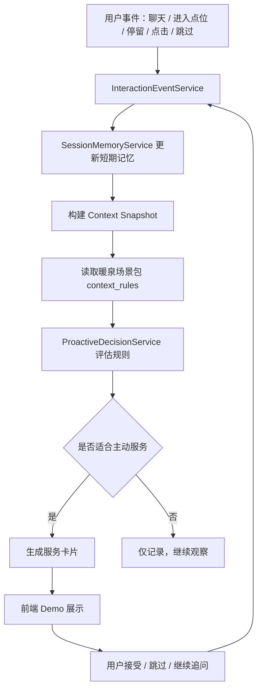
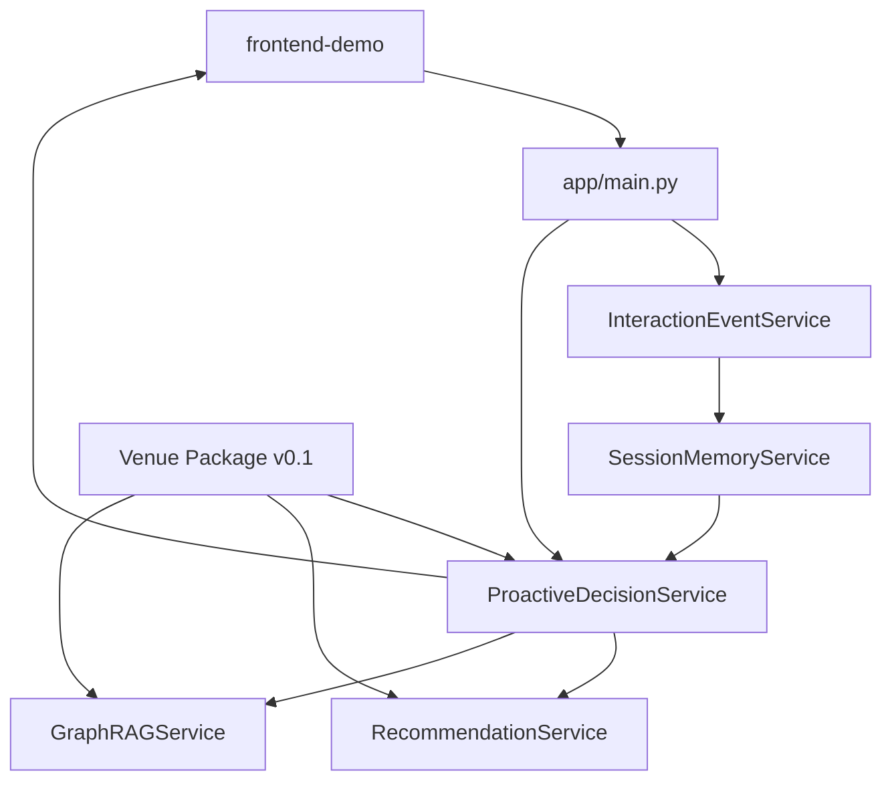

# 下一阶段技术方案：体验型主动服务闭环 v0.1.5

## 1. 阶段目标

下一阶段不追求完整平台化，也不把重点放在“解释系统为什么这样决策”。本阶段的重点是让暖泉古镇 Demo 从“问答 + 推荐”升级为“会接续、会记得、会主动但不打扰”的体验型数字人。

目标闭环：

```text
用户进入暖泉场景
  -> 系统识别当前点位、兴趣、同行人群、停留状态
  -> 写入本次会话短期记忆
  -> 根据 context_rules 判断是否需要主动服务
  -> 生成自然的下一步服务动作
  -> 用户接受、跳过或继续询问
  -> 交互事件继续沉淀，影响后续服务
```

本阶段完成后，Demo 应该能展示三件事：

- 数字人不是一次性问答，而是能围绕本次游览持续接续。
- 推荐不是静态列表，而是根据用户此刻状态动态变化。
- 主动服务不是强推，而是轻提示、可跳过、能记住用户反馈。

## 2. 当前基础

当前项目已有基础模块：

- `app/data/venues/nuanquan_ancient_town.json`：暖泉古镇场景包 v0.1
- `context_rules`：主动服务规则草案
- `app/services/recommendation_service.py`：路线、任务、文创推荐
- `app/rag/graph_rag_service.py`：Graph RAG 文化讲解
- `app/services/memory_store.py`：基础内存记忆
- `app/services/analytics_service.py`：行为事件与特征快照
- `app/main.py`：FastAPI 接口
- `frontend-demo/`：前端展示 Demo

下一步不重写这些模块，而是在它们之间补一层体验型主动决策能力。

## 3. 新增核心模块

建议新增三个模块：

```text
app/services/session_memory_service.py
app/services/interaction_event_service.py
app/decision/proactive_decision_service.py
```

### 3.1 SessionMemoryService：短期记忆服务

职责：

- 维护本次游览会话状态
- 记录最近点位、停留时间、兴趣信号、拒绝信号
- 记录用户已经接受或跳过的服务
- 为主动决策提供体验上下文

短期记忆结构：

```json
{
  "session_id": "s_001",
  "user_id": "u_001",
  "venue_id": "nuanquan_ancient_town",
  "current_spot_id": "spot_xigubao",
  "visit_stage": "exploring",
  "recent_messages": [
    {
      "role": "user",
      "text": "这里以前是做什么的？",
      "created_at": "2026-07-23T17:30:00"
    }
  ],
  "visited_spots": ["spot_service_center", "spot_xigubao"],
  "stay_time_by_spot": {
    "spot_xigubao": 240
  },
  "interest_signals": {
    "architecture": 0.4,
    "history": 0.3,
    "papercut": 0.0
  },
  "negative_signals": {
    "long_walk": 0.5,
    "commercial_push": 0.2
  },
  "accepted_actions": ["offer_deep_explanation"],
  "dismissed_actions": ["recommend_product_with_reason"],
  "last_triggered_rule_ids": ["rule_long_dwell_culture"],
  "last_service_at": "2026-07-23T17:31:00"
}
```

### 3.2 InteractionEventService：交互沉淀服务

职责：

- 统一接收聊天、停留、点击、跳过、收藏、任务完成等事件
- 把事件转换为短期记忆信号
- 为后续长期记忆晋升留下原始依据

事件结构：

```json
{
  "event_id": "evt_001",
  "user_id": "u_001",
  "session_id": "s_001",
  "venue_id": "nuanquan_ancient_town",
  "event_type": "dwell",
  "spot_id": "spot_xigubao",
  "content": null,
  "value": 240,
  "metadata": {
    "source": "frontend_demo"
  },
  "created_at": "2026-07-23T17:30:00"
}
```

本阶段事件先存内存即可，后续再迁移到数据库。

### 3.3 ProactiveDecisionService：主动决策服务

职责：

- 读取场景包中的 `context_rules`
- 结合短期记忆、当前 Context、推荐服务与 Graph RAG 能力
- 决定是否主动给出下一步服务
- 输出面向前端的服务卡片

它不是纯规则引擎，也不是大模型自由决策，而是一个“体验控制器”。

核心原则：

- 优先帮助用户完成当前游览目标
- 优先轻提示，不频繁打断
- 商业推荐后置，除非用户明显表现出兴趣或处于离场阶段
- 用户跳过后降低同类服务触发权重
- 未核验动态信息只作为提示，不做确定性承诺

## 4. 主动服务流程



## 5. Context Snapshot

本阶段建议把 Context 固化为一个轻量快照，供主动决策使用。

```json
{
  "user_id": "u_001",
  "session_id": "s_001",
  "venue_id": "nuanquan_ancient_town",
  "current_spot_id": "spot_xigubao",
  "location_text": "西古堡",
  "visit_stage": "exploring",
  "available_time_minutes": 90,
  "group_type": "family",
  "weather": "clear",
  "dwell_seconds": 240,
  "recent_intent": "culture_question",
  "interest_top": ["architecture", "history"],
  "fatigue_level": "medium",
  "disturbance_risk": "low"
}
```

其中 `fatigue_level` 和 `disturbance_risk` 本阶段可以用规则估算：

- 停留很久但没有互动：可能疲劳或犹豫
- 快速移动：不适合长讲解
- 连续跳过：打扰风险升高
- 亲子家庭：更适合任务型轻互动
- 离场阶段：可以轻量推荐收藏、纪念品或下一次行程

## 6. context_rules 接入方式

当前场景包已有：

```json
{
  "id": "rule_long_dwell_culture",
  "trigger": {
    "dwell_time_seconds_gte": 180,
    "spot_tags_any": ["古堡", "水陆壁画", "国家级非遗"]
  },
  "action": "offer_deep_explanation",
  "cooldown_minutes": 10
}
```

接入后执行逻辑：

```text
1. 找到当前场景包
2. 读取 context_rules
3. 对每条规则计算 match_score
4. 检查短期记忆中的冷却、跳过、接受记录
5. 根据体验策略调整优先级
6. 选择一个最适合的服务动作
7. 输出卡片或静默观察
```

规则不直接决定最终输出，最终输出由 `ProactiveDecisionService` 结合用户体验状态做二次判断。

## 7. 主动决策输出

建议主动决策输出结构：

```json
{
  "decision_id": "dec_001",
  "mode": "soft_prompt",
  "action": "offer_deep_explanation",
  "venue_id": "nuanquan_ancient_town",
  "spot_id": "spot_xigubao",
  "title": "这里可以听一个短故事",
  "message": "你已经走到西古堡了，我可以用 30 秒讲讲它为什么是暖泉的核心点位。",
  "primary_button": "听一段",
  "secondary_button": "先不用",
  "payload": {
    "knowledge_query": "西古堡的历史与空间价值",
    "estimated_duration_seconds": 30
  },
  "priority": 0.74,
  "expires_in_seconds": 120
}
```

`mode` 建议分为：

- `silent`：不展示，只记录
- `soft_prompt`：轻提示
- `card`：展示服务卡片
- `conversation`：数字人主动说一句
- `blocking_confirm`：需要用户确认，主要用于交易、票务、隐私授权

本阶段默认使用 `soft_prompt` 和 `card`，避免过强打扰。

## 8. 服务动作类型

建议先支持 5 类动作：

| action | 用户体验 |
| --- | --- |
| `recommend_route` | 给出下一段路线或整体路线 |
| `offer_deep_explanation` | 主动讲解当前点位 |
| `trigger_interactive_task` | 触发亲子 / 研学 / 探索任务 |
| `remind_dashuhua_route` | 提醒打树花相关路线或时间安排 |
| `recommend_product_with_reason` | 推荐文创或收藏项 |

注意：文创推荐默认放低优先级。除非满足以下条件之一：

- 用户主动问纪念品、特产、购物
- 用户完成了相关文化任务
- 用户处于离场阶段
- 用户多次表现出某类文化兴趣

## 9. 体验优先策略

本阶段主动服务的产品策略应当是：

```text
先陪伴，再推荐。
先帮助完成游览，再引导消费。
先轻提示，再长讲解。
先记住拒绝，再尝试下一种服务。
```

具体规则：

- 同一 `action` 在 10-20 分钟内不重复触发
- 用户连续跳过 2 次后，本次会话进入低打扰模式
- 用户处于快速移动状态时，只推荐路线，不推荐长讲解
- 用户在点位停留较久时，优先提供短讲解或拍照提示
- 亲子家庭优先推荐轻任务，而不是长篇文化讲解
- 消费推荐必须有文化关联，不能裸推商品
- 未核验的动态信息，例如演出时间，只能提示“建议确认”，不能确定性承诺

## 10. API 设计

### 10.1 记录交互事件

`POST /api/v1/session/events`

输入：

```json
{
  "user_id": "u_001",
  "session_id": "s_001",
  "venue_id": "nuanquan_ancient_town",
  "event_type": "dwell",
  "spot_id": "spot_xigubao",
  "value": 240,
  "metadata": {
    "source": "frontend_demo"
  }
}
```

输出：

```json
{
  "status": "ok",
  "session_memory": {},
  "next_decision": {}
}
```

### 10.2 获取当前短期记忆

`GET /api/v1/session/{session_id}/memory`

输出：

```json
{
  "session_id": "s_001",
  "memory": {}
}
```

### 10.3 获取主动服务建议

`POST /api/v1/proactive/decision`

输入：

```json
{
  "user_id": "u_001",
  "session_id": "s_001",
  "venue_id": "nuanquan_ancient_town",
  "current_spot_id": "spot_xigubao",
  "location_text": "西古堡",
  "context": {
    "dwell_seconds": 240,
    "group_type": "family",
    "available_time_minutes": 90
  }
}
```

输出：

```json
{
  "decision": {
    "mode": "soft_prompt",
    "action": "offer_deep_explanation",
    "title": "这里可以听一个短故事",
    "message": "我可以用 30 秒讲讲西古堡为什么是暖泉的核心点位。",
    "primary_button": "听一段",
    "secondary_button": "先不用"
  }
}
```

## 11. 前端 Demo 改造

前端不需要做成复杂后台，建议新增三个展示区：

### 11.1 当前状态条

展示：

- 当前点位
- 游览阶段
- 停留时间
- 当前兴趣
- 低打扰 / 正常服务状态

### 11.2 主动服务卡片

展示系统给出的下一步建议：

- “听一段”
- “开始任务”
- “调整路线”
- “稍后提醒”
- “先不用”

### 11.3 本次记忆面板

展示本次会话中系统记住的内容：

- 已看过的点位
- 感兴趣的主题
- 跳过的服务
- 已完成的任务

注意：这个面板不是为了技术解释，而是为了让用户感觉“它真的记得我刚才做过什么”。

## 12. 与现有模块的关系



复用关系：

- 场景知识继续来自 `Venue Package v0.1`
- 路线、任务、文创候选继续来自 `RecommendationService`
- 文化讲解继续来自 `GraphRAGService`
- 行为统计继续兼容 `AnalyticsService`
- 原有 `/api/v1/chat` 保持可用

## 13. 开发顺序

建议按以下顺序实现：

1. 定义 Pydantic 数据模型
   - `SessionMemory`
   - `InteractionEvent`
   - `ContextSnapshot`
   - `ProactiveDecision`

2. 实现 `SessionMemoryService`
   - 内存存储
   - 更新点位停留
   - 更新兴趣信号
   - 记录接受 / 跳过

3. 实现 `InteractionEventService`
   - 统一处理 `chat`、`dwell`、`enter_spot`、`skip`、`accept`、`task_complete`
   - 将事件转成短期记忆更新

4. 实现 `ProactiveDecisionService`
   - 读取场景包 `context_rules`
   - 匹配触发条件
   - 应用体验策略
   - 输出服务卡片

5. 增加 API
   - `/api/v1/session/events`
   - `/api/v1/session/{session_id}/memory`
   - `/api/v1/proactive/decision`

6. 改造前端 Demo
   - 当前状态条
   - 主动服务卡片
   - 本次记忆面板

7. 补测试
   - 长停留触发讲解
   - 亲子场景触发任务
   - 跳过后不重复打扰
   - 离场阶段才触发文创推荐

## 14. 本阶段不做的事

为了保持 Demo 开发节奏，本阶段暂不做：

- 数据库持久化
- 真实定位 SDK
- 完整 LLM Tool Calling
- 多用户权限系统
- 内容管理后台
- 真实支付、票务、电商交易
- 长期记忆晋升与遗忘机制的完整实现

这些放到 Phase 1 或试点版本更合适。

## 15. 验收标准

本阶段完成后，应该能演示以下路径：

### 路径 A：西古堡停留触发讲解

```text
用户进入西古堡
  -> 停留超过 180 秒
  -> 系统识别为文化兴趣
  -> 主动提示“要不要听一段短故事”
  -> 用户点击“听一段”
  -> Graph RAG 返回西古堡讲解
  -> 短期记忆记录用户接受文化讲解
```

### 路径 B：亲子家庭触发互动任务

```text
用户画像为 family
  -> 到达古街巷或剪纸体验点
  -> 系统给出轻任务
  -> 用户完成任务
  -> 系统沉淀“亲子互动 / 非遗兴趣”
```

### 路径 C：用户跳过后降低打扰

```text
系统推荐文创
  -> 用户点击“先不用”
  -> 本次会话记录 dismissed_action
  -> 后续不再短时间重复文创推荐
```

### 路径 D：离场阶段自然推荐收藏

```text
用户游览进入 leaving 阶段
  -> 系统根据已看过点位和兴趣
  -> 推荐收藏路线、生成记忆卡片或轻量文创
```

## 16. 推荐结论

下一阶段最合理的技术定位是：

```text
在不重构整体项目的前提下，
给当前 Demo 增加一条体验型主动服务闭环。
```

这条闭环会让产品从“有知识、有推荐”进入“能陪伴、能接续、能主动”的状态，是暖泉场景包版本最关键的一次体验升级。
